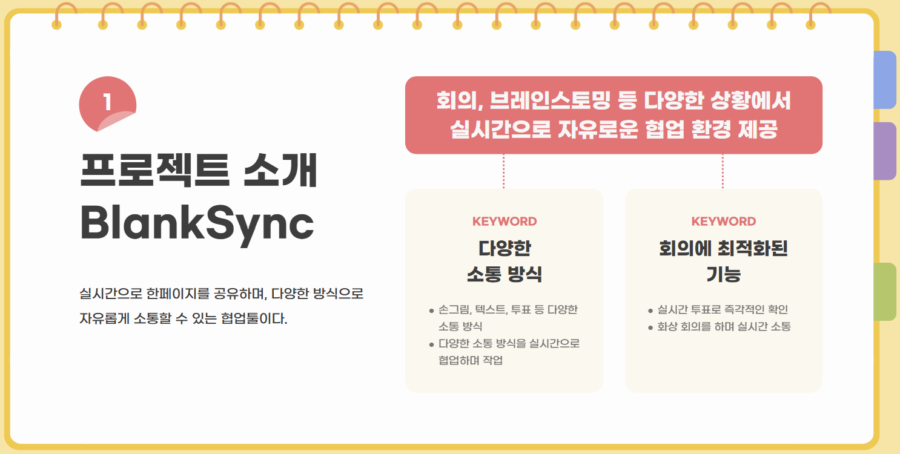
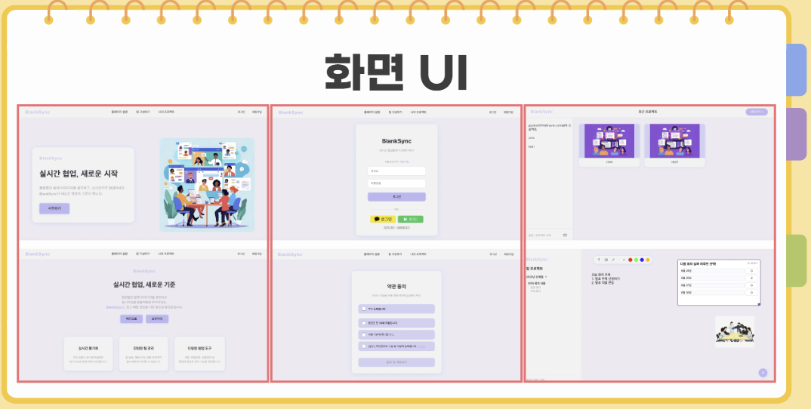
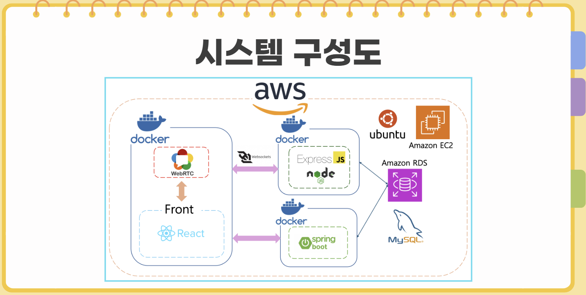
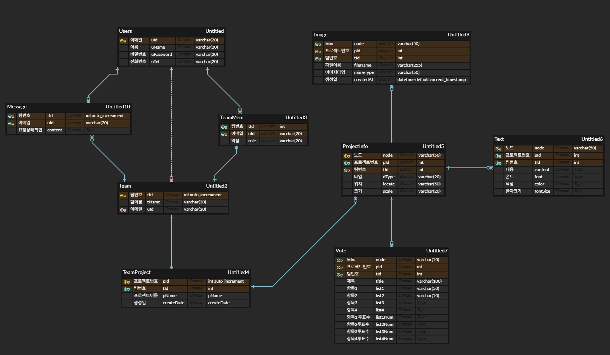

# CMM - 실시간 원격 협업 플랫폼

  

 

## 🙋‍♂️ 팀원소개
본 프로젝트는 4인 팀으로 진행되었으며, 저는 팀장 역할과 프론트엔드 개발을 주도적으로 담당했습니다. 이 레포지토리는 제가 담당한 프론트엔드 파트의 소스 코드를 담고 있습니다.

| 역할 | 개발자 | 주요 담당 업무 |
|---------|-----------|----------------|
| **👑 팀장 / 프론트엔드** | **박수현** [@park-soo-hyeon](https://github.com/park-soo-hyeon) | UI/UX 설계 및 전체 컴포넌트 구현, API 연동, 전역 상태 관리, 프로젝트 총괄 |
| **👥 팀원 / 풀스택** | **김규한** [@gyuhan0114](https://github.com/gyuhan0114) | 프론트엔드 및 백엔드 개발 |
| **👥 팀원 / 백엔드** | **유현하** [@yoohyunha](https://github.com/yoohyunha) | 실시간 동기화 서버 개발 |
| **👥 팀원 / 백엔드** | **임현** [@limhyun0319](https://github.com/limyun0319) | 회원 관리 및 인증, 실시간 동기화 서버 외의 백엔드 개발 |

 

---

## 🛠️ 프로젝트 개요
  

 

## 🎨 주요 화면 및 UI

제가 구현한 주요 UI 화면입니다. Figma 디자인을 기반으로 모든 컴포넌트를 직접 구현했습니다.
  

 

---

## 🎯 주요 기능 구현
프론트엔드 개발자로서 다음과 같은 핵심 기능들을 구현했습니다.

- **UI/UX 설계 및 구현**: Figma 디자인 시스템을 기반으로 모든 페이지와 컴포넌트를 React와 TypeScript를 사용하여 구현했습니다.
- **API 연동**: Axios를 활용하여 백엔드 RESTful API와 통신하고, 비동기 데이터를 처리하여 화면에 렌더링하는 로직을 구현했습니다.
- **전역 상태 관리**: React Context API 또는 Zustand/Recoil 등의 상태 관리 라이브러리를 활용하여 사용자 인증 정보, 프로젝트 데이터 등 전역적으로 필요한 상태를 효율적으로 관리했습니다.
- **실시간 동기화 연동**: 백엔드의 실시간 서버와 연동하여 여러 사용자가 동시에 작업할 때 발생하는 변경사항(텍스트, 투표, 이미지 등)이 화면에 즉시 반영되도록 구현했습니다.
- **사용자 인증 흐름 구현**: 회원가입, 로그인, 소셜 로그인(네이버/카카오) 등 사용자 인증에 필요한 모든 프론트엔드 로직과 UI를 구현했습니다.
- **반응형 웹 디자인**: 다양한 디바이스(모바일, 데스크톱)에서 최적화된 화면을 볼 수 있도록 반응형 레이아웃을 적용했습니다.

 

### ⚙️ 기술 스택 (Tech Stack)

  

    <h4 style="margin: 0; min-width: 100px;">프론트엔드</h4>
    
    
  

  

    <h4 style="margin: 0; min-width: 100px;">백엔드</h4>
    
    
    
  

  

    <h4 style="margin: 0; min-width: 100px;">배포</h4>
    
    
  

  

    <h4 style="margin: 0; min-width: 100px;">협업툴</h4>
    
    
    
  

 

---

## 📖 프로젝트 회고 (My Reflection)
이번 졸업 작품 프로젝트에서 전반적인 진행과 UI 구성, 그리고 프론트엔드(React) 페이지 제작 및 API 연동 구현을 담당했습니다.
리액트로 개발을 한다고 해서 리액트만 잘하면 되는 것이 아니라는 점을 깨달았고, 백엔드와의 소통이 얼마나 중요한지 직접 경험할 수 있었습니다. 처음에는 어떻게 진행해야 할지, 개발을 어떻게 시작해야 할지 막막했지만, 시간이 지나면서 점차 방법을 익혀 프로젝트를 성공적으로 마칠 수 있어 뿌듯했습니다. 직접 프로젝트를 진행하면서 개발 역량도 많이 성장했고, 많은 값진 경험을 쌓을 수 있었습니다.

  
  ## ⚙️ 시스템 구성 및 백엔드 정보 (참고용)
  
  ### 시스템 구성도
  
  
  ### ERD
  

 

---

## 🔗 관련 링크
### 🎬 시연 영상
  <a href="https://youtu.be/aE4ufO2oBOs">@영상보러가기</a> 

### 🐙 팀 GitHub Organization
  <a href="https://github.com/DMU-CMM-Final" >@DMU_CMM_Final </a>  

### 🗂 팀 Notion: 프로젝트 관리 페이지
  <a href="https://www.notion.so/1adf95c37f3c809d8403e7917c7367fd? v=1adf95c37f3c814f83b7000cd48043a9&source=copy_link" target="_blank">@CMM</a> 
